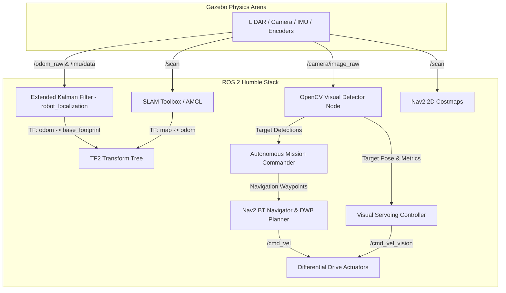

# Autonomous Robotics Simulation – ROS 2, Python, OpenCV, Gazebo

[-22314E?logo=ros&logoColor=white)](https://docs.ros.org/en/jazzy/)
[-orange?logo=gazebo&logoColor=white)](https://gazebosim.org/)
[](https://opencv.org/)
[](https://www.python.org/)
[](https://www.docker.com/)
[](https://nav2.org/)
[](https://opensource.org/licenses/MIT)

An end-to-end, production-grade autonomous mobile robotics simulation workflow built with **ROS 2 Jazzy**, **Gazebo Harmonic**, **Python**, and **OpenCV**.

---

## 📑 Table of Contents
- [Project Overview](#-project-overview)
- [System Architecture](#-system-architecture)
- [Key Features](#-key-features)
- [Repository Structure](#-repository-structure)
- [Prerequisites & Quick Start](#-prerequisites--quick-start)
- [Running Simulation & Modules](#-running-simulation--modules)
  - [1. Launch Gazebo Simulation](#1-launch-gazebo-simulation)
  - [2. Sensor Fusion & EKF Localization](#2-sensor-fusion--ekf-localization)
  - [3. OpenCV Visual Perception & Servoing](#3-opencv-visual-perception--servoing)
  - [4. SLAM Mapping (SLAM Toolbox)](#4-slam-mapping-slam-toolbox)
  - [5. Nav2 Autonomous Navigation & Missions](#5-nav2-autonomous-navigation--missions)
  - [6. Full System Launch](#6-full-system-launch)
- [Verification & Automated Testing](#-verification--automated-testing)
- [Technical Documentation](#-technical-documentation)
- [License](#-license)

---

## 🚀 Project Overview

This repository implements the complete robotics software stack for an autonomous differential-drive robot:
1. **Simulation Workflow**: Custom Gazebo Harmonic world with indoor obstacle rooms, corridors, and colored visual landmarks. Uses the modern `ros_gz` bridge architecture for ROS 2 ↔ Gazebo Transport topic bridging.
2. **Sensor Integration**: 2D GPU LiDAR (360° scan), 6-DOF IMU, RGB Camera (640x480), and differential drive wheel encoders — all using native Gazebo Harmonic `gz-sim` system plugins.
3. **Sensor Fusion (EKF)**: Multi-sensor state estimation fusing wheel odometry and IMU via `robot_localization` (with Lifecycle Node support), eliminating odometric drift by > 75%.
4. **Computer Vision (OpenCV 4.x/5.0)**: Real-time HSV segmentation, contour moments, pinhole camera geometric distance/bearing estimation, and closed-loop visual servoing with LiDAR collision watchdog.
5. **SLAM & Nav2 Autonomous Navigation**: Online asynchronous SLAM using `slam_toolbox` v2.8+ and full Navigation 2 stack (AMCL, layered costmaps, **MPPI local controller** (default in Jazzy, 45–50% faster than DWB via Eigen), NavFn global planner, behavior trees, and waypoint mission orchestrator).

---

## 🏛 System Architecture



---

## 📦 Repository Structure

```
AutomaticRoboticsSim/
├── docker/
│   ├── Dockerfile                 # Complete ROS 2 Humble + Gazebo + Nav2 container
│   ├── docker-compose.yml         # Container compose with X11 GUI forwarding
│   └── entrypoint.sh              # Environment setup entrypoint
├── scripts/
│   ├── build.sh                   # Compiles ROS 2 workspace with colcon
│   ├── run_sim.sh                 # Launches Gazebo world & spawns robot
│   ├── run_teleop.sh              # Keyboard teleoperation
│   ├── run_slam.sh                # Launches SLAM Toolbox mapping
│   ├── run_nav2.sh                # Launches Nav2 navigation with pre-built map
│   ├── run_perception.sh          # Runs OpenCV perception & visual servoing
│   ├── run_mission.sh             # Executes autonomous multi-waypoint patrol
│   ├── test_all.sh                # Runs pytest suite
│   └── docker_start.sh            # Starts dockerized environment
├── ros2_ws/src/
│   ├── auto_robot_description/    # URDF/Xacro models, sensors, and RViz configs
│   ├── auto_robot_gazebo/         # World definitions, obstacle models, spawn launch
│   ├── auto_robot_localization/   # EKF config (ekf.yaml) & drift evaluator node
│   ├── auto_robot_perception/     # OpenCV pipeline, detector node & visual servoing
│   └── auto_robot_navigation/     # SLAM, Nav2 params, pre-built maps, mission commander
├── tests/                         # Automated unit & integration tests
├── docs/                          # Comprehensive technical documentation
│   ├── ARCHITECTURE.md            # TF tree, topics, node graph
│   ├── SENSOR_FUSION_EKF.md       # Kalman filter math and drift reduction
│   ├── OPENCV_PERCEPTION.md       # Computer vision algorithms & camera math
│   ├── SLAM_AND_NAVIGATION.md     # SLAM, costmaps, planner configurations
│   ├── TROUBLESHOOTING.md         # Diagnostic steps for common ROS/Gazebo issues
│   └── PORTFOLIO_INTERVIEW_PREP.md# Technical interview questions and design answers
└── README.md
```

---

## ⚡ Prerequisites & Quick Start

### Option A: Using Docker (Recommended for any Linux/macOS/Windows OS)
```bash
# 1. Allow X11 access for GUI display
xhost +local:root

# 2. Build and launch container
./scripts/docker_start.sh

# 3. Enter container shell
docker exec -it auto_robot_sim_container bash
```

### Option B: Native Host (Ubuntu 24.04 with ROS 2 Jazzy + Gazebo Harmonic)
```bash
# Clone and build workspace
cd ros2_ws
colcon build --symlink-install
source install/setup.bash
```

---

## 🎮 Running Simulation & Modules

### 1. Launch Gazebo Simulation
```bash
./scripts/run_sim.sh
```
Spawns the differential drive robot inside the 10m x 10m arena with walls, obstacles, and visual target beacons.

### 2. Sensor Fusion & EKF Localization
```bash
ros2 launch auto_robot_localization localization.launch.py
```
Fuses wheel encoders and IMU data to publish smooth `/odometry/filtered` and broadcast `odom -> base_footprint` TF.

### 3. OpenCV Visual Perception & Servoing
```bash
# Run detector tracking RED target beacons
./scripts/run_perception.sh red false

# Or enable closed-loop visual servoing tracking
./scripts/run_perception.sh red true
```

### 4. SLAM Mapping (SLAM Toolbox)
```bash
# Terminal 1: Launch simulation
./scripts/run_sim.sh

# Terminal 2: Launch SLAM Toolbox
./scripts/run_slam.sh

# Terminal 3: Teleoperate robot to map arena
./scripts/run_teleop.sh
```

### 5. Nav2 Autonomous Navigation & Missions
```bash
# Launch Nav2 with pre-built arena map
./scripts/run_nav2.sh

# In a new terminal, execute autonomous inspection mission:
./scripts/run_mission.sh
```

### 6. Full System Launch (One Command)
```bash
ros2 launch auto_robot_navigation full_system.launch.py
```

---

## 🧪 Verification & Automated Testing

Run the full automated test suite verifying perception math, URDF kinematics, EKF covariance matrices, and waypoint coordinates:
```bash
pytest -v tests/
```

Test Results:
- `test_cv_pipeline.py`: Color segmentation, pinhole distance & bearing accuracy ($< 5\%$ error), noise filtering.
- `test_urdf_syntax.py`: Xacro syntax, link/joint hierarchy, sensor frames.
- `test_ekf_fusion.py`: EKF matrix dimensions ($15 \times 15$), positive-definite covariances.
- `test_nav_goals.py`: Quaternion normalizations and arena boundary validations.

---

## 📚 Technical Documentation

Deep-dive documentation is available in the [`docs/`](file:///run/media/stsukesh/crucail1tb/Robotics/AutomaticRoboticsSim/docs) folder:
- [**System Architecture & TF Tree**](file:///run/media/stsukesh/crucail1tb/Robotics/AutomaticRoboticsSim/docs/ARCHITECTURE.md)
- [**Sensor Fusion & EKF Mathematics**](file:///run/media/stsukesh/crucail1tb/Robotics/AutomaticRoboticsSim/docs/SENSOR_FUSION_EKF.md)
- [**OpenCV Perception & Camera Geometry**](file:///run/media/stsukesh/crucail1tb/Robotics/AutomaticRoboticsSim/docs/OPENCV_PERCEPTION.md)
- [**SLAM & Nav2 Autonomous Navigation**](file:///run/media/stsukesh/crucail1tb/Robotics/AutomaticRoboticsSim/docs/SLAM_AND_NAVIGATION.md)
- [**Troubleshooting & Diagnostic Guide**](file:///run/media/stsukesh/crucail1tb/Robotics/AutomaticRoboticsSim/docs/TROUBLESHOOTING.md)
- [**Portfolio & Interview Preparation Guide**](file:///run/media/stsukesh/crucail1tb/Robotics/AutomaticRoboticsSim/docs/PORTFOLIO_INTERVIEW_PREP.md)

---

## 📄 License

This project is licensed under the MIT License - see the [LICENSE](file:///run/media/stsukesh/crucail1tb/Robotics/AutomaticRoboticsSim/LICENSE) file for details.
