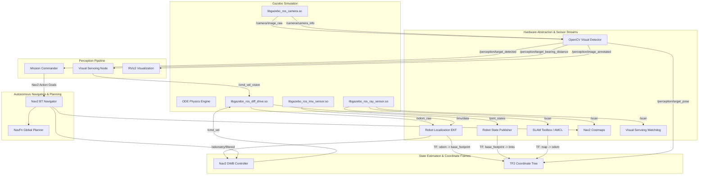

# System Architecture & Technical Design

## 1. High-Level Architecture Overview

The **Autonomous Robotics Simulation** repository implements a modular, production-grade ROS 2 autonomous mobile robot system. The pipeline integrates physics simulation, multi-sensor perception, Kalman filtering, SLAM, global/local path planning, and autonomous mission dispatching.

---

## 2. Coordinate Transformations (TF Tree)

Standard ROS REP-105 compliance is strictly maintained:

$$\text{map} \xrightarrow[\text{SLAM / AMCL}]{} \text{odom} \xrightarrow[\text{robot\_localization EKF}]{} \text{base\_footprint} \xrightarrow[\text{URDF Static}]{} \text{base\_link} \xrightarrow[\text{URDF Static}]{} \begin{cases} \text{chassis} \to \text{laser\_frame} \\ \text{chassis} \to \text{camera\_link} \to \text{camera\_link\_optical} \\ \text{chassis} \to \text{imu\_link} \\ \text{base\_link} \to \text{left\_wheel} \\ \text{base\_link} \to \text{right\_wheel} \end{cases}$$

### Frame Definitions:
- **`map`**: World-fixed coordinate frame with origin at the global mapping datum. Global localization algorithms (AMCL / SLAM Toolbox) publish the `map -> odom` transformation to correct for long-term odometric drift.
- **`odom`**: World-fixed coordinate frame that is continuous and locally smooth (without discrete jumps). The Extended Kalman Filter (`robot_localization`) publishes the `odom -> base_footprint` transformation by fusing wheel encoders and IMU.
- **`base_footprint`**: 2D planar projection of the robot chassis on the ground surface ($Z = 0$).
- **`base_link`**: Center of the robot's differential drive axle.
- **`camera_link_optical`**: Optical camera frame rotated by $-90^\circ$ pitch and $-90^\circ$ yaw to adhere to standard camera convention ($+Z$ forward into the scene, $+X$ right, $+Y$ down).

---

## 3. Sensor Pipeline Specifications

| Sensor Type | ROS 2 Topic | Message Type | Update Rate | Purpose |
| :--- | :--- | :--- | :--- | :--- |
| **2D LiDAR** | `/scan` | `sensor_msgs/msg/LaserScan` | 10 Hz | 360° obstacle avoidance, SLAM mapping, and AMCL particle localization |
| **IMU** | `/imu/data` | `sensor_msgs/msg/Imu` | 50 Hz | High-rate angular velocity ($\omega_z$) and linear acceleration ($a_x, a_y$) for EKF fusion |
| **Monocular Camera** | `/camera/image_raw` | `sensor_msgs/msg/Image` | 30 Hz | RGB image feed (640x480) for OpenCV color segmentation and visual servoing |
| **Camera Info** | `/camera/camera_info` | `sensor_msgs/msg/CameraInfo` | 30 Hz | Intrinsic matrix ($f_x, f_y, c_x, c_y$) and distortion parameters |
| **Wheel Odometry** | `/odom_raw` | `nav_msgs/msg/Odometry` | 50 Hz | Encoder-based differential drive displacement and velocities |
| **Fused Odometry** | `/odometry/filtered` | `nav_msgs/msg/Odometry` | 30 Hz | State-estimated pose and twist from EKF filter |
| **Vision Telemetry** | `/perception/target_bearing_distance` | `geometry_msgs/msg/Vector3` | 30 Hz | Estimated distance ($m$), bearing angle ($\text{rad}$), and contour area |
