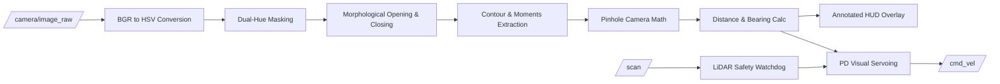

# OpenCV Perception & Visual Servoing Pipeline

## 1. Perception Pipeline Architecture

The `auto_robot_perception` package processes live RGB imagery from the robot's front-mounted monocular camera to identify visual markers, extract 3D geometric information, and command closed-loop tracking behaviors.

---

## 2. Image Processing Stages

### 2.1 Color Segmentation in HSV Space
RGB color space is sensitive to shadows and illumination variations. We transform RGB frames to the **Hue-Saturation-Value (HSV)** representation:

$$\text{BGR} \xrightarrow{\text{cv2.cvtColor}} \text{HSV}$$

For **Red target markers**, which span both ends of the $0^\circ - 180^\circ$ hue circle in OpenCV, we perform dual-range thresholding and bitwise OR:
$$\mathcal{M}_{\text{red}} = \text{inRange}(H \in [0, 10], S \in [100, 255], V \in [70, 255]) \cup \text{inRange}(H \in [160, 180], S \in [100, 255], V \in [70, 255])$$

### 2.2 Morphological Noise Filtering
To eliminate isolated noise pixels and fill small voids within the segmented blob:
$$\mathcal{M}_{\text{clean}} = (\mathcal{M}_{\text{red}} \circ K_{\text{ellipse}}^{(5 \times 5)}) \bullet K_{\text{ellipse}}^{(9 \times 9)}$$
- **Opening ($\circ$)**: Erosion followed by dilation removes high-frequency speckles.
- **Closing ($\bullet$)**: Dilation followed by erosion seals internal voids.

### 2.3 Contour Extraction and Centroid Calculation
Given the largest valid contour $C$ with area $A > A_{\text{min}}$:

$$\text{Centroid: } c_x = \frac{M_{10}}{M_{00}}, \quad c_y = \frac{M_{01}}{M_{00}}$$

where $M_{pq} = \sum_{x, y} x^p y^q I(x, y)$ are the standard spatial moments.

---

## 3. Pinhole Camera Geometry & Distance Estimation

Using known target physical dimensions ($H_{\text{real}} = 0.6\text{ m}, W_{\text{real}} = 0.3\text{ m}$) and camera intrinsics from `/camera/camera_info`:

$$\text{Intrinsic Matrix: } \mathbf{K} = \begin{bmatrix} f_x & 0 & c_x \\ 0 & f_y & c_y \\ 0 & 0 & 1 \end{bmatrix}$$

### 3.1 Depth Estimation ($Z$)
$$Z \approx \frac{f_y \cdot H_{\text{real}}}{h_{\text{pixels}}}$$

### 3.2 3D Metric Coordinates in Optical Frame ($X, Y, Z$)
$$X = \frac{(c_x - c_{\text{optical},x}) \cdot Z}{f_x}, \quad Y = \frac{(c_y - c_{\text{optical},y}) \cdot Z}{f_y}$$

### 3.3 Bearing Angle ($\theta$)
$$\theta = \arctan2(c_x - c_{\text{optical},x}, f_x)$$

---

## 4. Closed-Loop Visual Servoing Controller

The `visual_servoing_node` implements a continuous Proportional-Derivative (PD) controller:

### 4.1 Angular Control (Centering Target in Camera FOV)
$$v_\theta(t) = -K_{p,\theta} \cdot \theta(t) - K_{d,\theta} \cdot \frac{d\theta(t)}{dt}$$

### 4.2 Linear Control (Maintaining Stand-off Distance $d^* = 0.8\text{m}$)
$$e_d(t) = Z(t) - d^*$$
$$v_x(t) = K_{p,d} \cdot e_d(t) + K_{d,d} \cdot \frac{de_d(t)}{dt}$$

### 4.3 Multi-Sensor LiDAR Safety Watchdog
To prevent collisions when tracking moving or static targets near walls, the node checks the frontal LiDAR scan arc ($[-30^\circ, +30^\circ]$):
$$\text{If } \min(r_{\text{front}}) < d_{\text{safety}} \, (0.35\text{m}) \implies v_x = 0.0, \, v_\theta = 0.0$$
