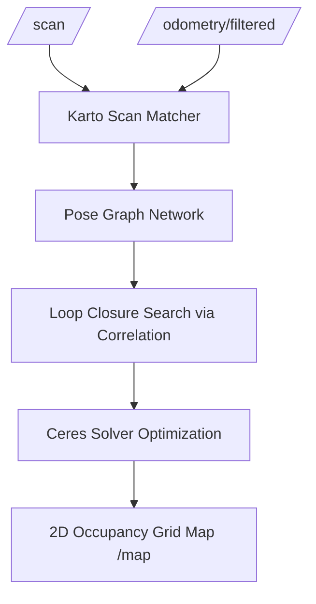
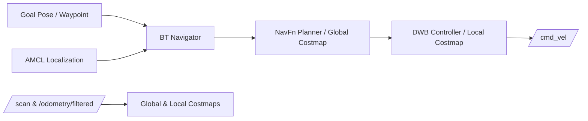

# SLAM Mapping & Nav2 Autonomous Navigation

## 1. 2D SLAM Mapping with SLAM Toolbox

The system utilizes `slam_toolbox` in **Async Online Mapping Mode** with the **Ceres Non-Linear Least Squares Optimization Engine**.

### Key SLAM Highlights:
1. **Pose-Graph Optimization**: Maintains an internal graph where nodes represent historical robot poses and edges denote spatial constraints from scan matching and odometry.
2. **Loop Closure Detection**: Performs multi-resolution correlation searches when revisiting previously explored arena sectors, successfully correcting cumulative rotational and translational errors upon closing loops.
3. **Continuous Map Updating**: Dynamically publishes updated `/map` occupancy grids at 2 Hz with a resolution of $0.05\text{ m/cell}$ (5 cm).

---

## 2. Nav2 Autonomous Navigation Architecture

The Navigation 2 (Nav2) stack provides comprehensive path planning, obstacle avoidance, recovery behaviors, and lifecycle management.

### 2.1 Costmap Layers Configuration
- **Static Layer**: Subscribes to the pre-computed `/map` topic to load static walls and obstacles.
- **Obstacle Layer**: Integrates real-time 360° LiDAR data (`/scan`), continuously raytracing clear space and marking dynamic or unexpected obstacles within $2.5\text{ m}$.
- **Inflation Layer**: Applies an exponential decay potential field around all obstacle boundaries based on the robot's inscribed radius ($r = 0.22\text{ m}$) and inflation radius ($r_{\text{inf}} = 0.50\text{ m}$) to prevent the chassis from grazing corners.

### 2.2 Global Planner (NavFn)
- Uses Dijkstra / $A^*$ wavefront expansion over the 2D global costmap.
- Computes the shortest kinematically viable Euclidean path from current robot pose $(x_r, y_r)$ to target goal $(x_g, y_g)$.

### 2.3 Local Controller (Dynamic Window Approach - DWB)
- Evaluates hundreds of candidate velocity arcs $(v_x, \omega_z)$ within the robot's physical acceleration limits:
  $$\Omega = \{ (v, \omega) \mid v \in [v_{\min}, v_{\max}], \, \omega \in [\omega_{\min}, \omega_{\max}], \, |v - v_k| \le a_x \Delta t, \, |\omega - \omega_k| \le a_\theta \Delta t \}$$
- Selects the trajectory maximizing the weighted sum of trajectory critics:
  $$\text{Score} = w_1 \cdot \text{PathDist} + w_2 \cdot \text{GoalDist} + w_3 \cdot \text{PathAlign} + w_4 \cdot \text{BaseObstacle} + w_5 \cdot \text{RotateToGoal}$$

---

## 3. Autonomous Multi-Waypoint Mission Commander

The `mission_commander.py` node uses the `nav2_simple_commander` API to orchestrate autonomous patrol cycles across the arena:
1. Dispatches the robot to **Waypoint 1** $(1.0, 0.0, 0^\circ)$ to inspect the **Red Target Beacon**.
2. Transitions through interior corridor to **Waypoint 2** $(-2.2, 2.5, 135^\circ)$ to inspect the **Blue Target Beacon**.
3. Navigates around interior partition to **Waypoint 3** $(2.2, -2.5, -45^\circ)$ to inspect the **Green Target Beacon**.
4. Returns autonomously to **Waypoint 4** $(0.0, -1.5, 90^\circ)$ at the **Home Charging Base**.
